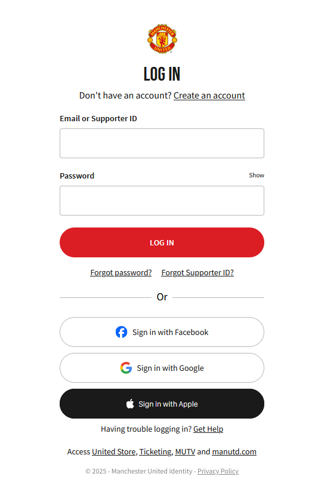

# 
📌 Replika prijavnega okna za nogometni klub Manchester United

Replika (kopija) prijavne strani Manchester United, narejena za učenje **HTML/CSS/JS** ter razumevanje strukture login obrazcev.  
Projekt **ni povezan z Manchester United FC** – narejen je izključno za izobraževalne namene.

---

## 🌐 Spletna stran

Stran si lahko pogledaš tukaj 👉  
**https://jakobferfolja007.github.io/Copy_Login_ManUtd/**

---

## 🔍 Primerjava

  

    
Originalni login obrazec

    
  

  

    
Moj login obrazec

    
  

---

## 🎯 Namen projekta
- Vadba **HTML**, **CSS** in **JavaScript**
- Učenje kopiranja vizualnega dizajna (UI layout)
- Razumevanje strukture login obrazcev
- Delo z JS knjižnicami (**SweetAlert**)
- Maskiranje e-maila in gesla (prikaz skritih znakov)

---

## 📁 Struktura projekta
- `index.html` – glavna datoteka s strukturo obrazca  
- `style.css` – glavni CSS za stilizacijo  
- `js/` – JavaScript datoteki:
  - **login.js** – maskira e-mail in geslo + SweetAlert
  - **register.js** – validacija in maskiranje gesla
- `img/` – slike projekta

---

## ⚙️ Tehnične podrobnosti
- **login.js**  
  - maskiranje e-m
